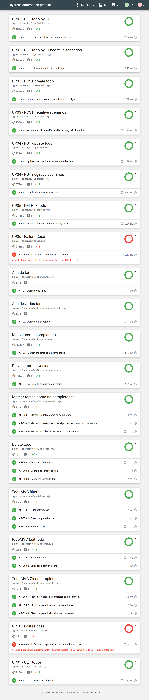
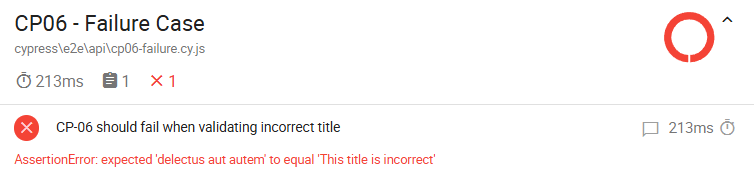
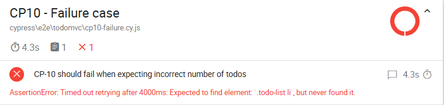

# Cypress Testing Project (API + UI)
This project contains automated tests built with Cypress, covering both API and UI testing scenarios. It demonstrates validation of CRUD operations, user interactions and error handling using real-world application.

---

### 🧪 Tech Stack

- **Cypress**
- **JavaScript**
- **Cypress-Mochawesome Reporter**
 
---

### 🌐 Applications under test

#### 🔹 API Testing:
- Base URL: `https://jsonplaceholder.typicode.com`
- Endpoints tested:
  - `GET /posts`
  - `GET /posts/{id}`
  - `POST /posts`
  - `PUT /posts/{id}`
  - `DELETE /posts/{id}`
  
### 🔹 UI Testing:
- Base URL: `https://todomvc.com/examples/react/dist/#/active`
- Features tested:
  - Add new tasks
  - Mark tasks as completed
  - Delete tasks
  - Filter tasks (All, Active, Completed)

---

### 📋 Features

- API Testing (CRUD operations)
- UI Testing (user flows)
- Positive and negative test cases
- Reusable commands and fixtures
- Mochawesome reporting

---

### 🛠️ Installation

```npm install```

---

### ▶️ Run Tests

Open Cypress (UI mode):

```npx cypress open``` 

Run all tests (headless mode):

```npx cypress run```

---

### 📊 Test Reports

This project uses Mochawesome for generating test reports. After running the tests, open: 

### 🔍 Report Overview


### 🔍 Report Overview Details


### ❌ API Failure Example


### ❌ UI Failure Example


These reports provide insights into test execution, including passed/failed tests, error messages, and screenshots for failed cases.

Failing tests cases were intentionally created to demonstrate the reporting capabilities and to validate error handling in both API and UI tests.

---

### 🧠 Testing Approach

Tests were designed following QA best practices:

- Clear and independent test cases
- Validation of both happy and edge cases
- Separation between API and UI tests
- Reusable and maintainable code structure

---

### 📈 Future Improvements

- CI/CD integration using GitHub Actions
- Environment configuration
- Cross-browser testing
- Integration with performance testing tools (e.g. Apache JMeter)
 
---

### 👨‍💻 Author

Gabriel Azubel
